# EmotiCode: Low-Resource Emotion Classification with Gemma-3

EmotiCode is a robust NLP pipeline designed to classify emotions in low-resource, linguistically diverse languages (Santali, Kashmiri, Manipuri) using Google's **Gemma-3-1B-IT**. 

This solution overcomes the data scarcity of Kashmiri, Manipuri and Santhali scripts by employing a **Hybrid Architecture** that combines Script Romanization, Semantic Vector Fusion, and Soft-Prompt Injection.

## 🧠 The Architecture

Standard LLM fine-tuning struggle with low-resource scripts. This particular strategy improves upon it via a three-pronged strategy:

### 1. Script Normalization (Romanization)
Since Gemma is pre-trained heavily on Latin scripts, native scripts are treated as noise. Transliteration (**Aksharamukha**) is used to convert all inputs into the Latin alphabet.
* **Example:** नमस्ते (Hindi script) $\rightarrow$ *Namaste* (Phonetic Latin).
* **Benefit:** Allows Gemma to recognize cognates, loan words, and phonetic patterns it already knows.

### 2. Semantic Vector Fusion (1792-dim)
Fused two state-of-the-art embedding models to create a dense representation of the sentence:
* **NLLB-200 (1024-dim):** Captures massive cross-lingual alignment.
* **LaBSE (768-dim):** Captures sentence-level semantic similarity.
* **Total Input:** A rich 1792-dimensional vector representing the meaning, regardless of the language.

### 3. Hybrid Injection & Mixup
Fed both the Romanized Text and the Fused Vector into Gemma.
* The Vector is projected and injected as a **Soft Prompt** (prefix token).
* The Text follows standard tokenization.
* **Mixup Augmentation:** Applied manifold mixup on the vector space to synthesize new training examples, effectively expanding the dataset.

| Component      | Specification                        |
| -------------- | ------------------------------------ |
| Base Model     | google/gemma-3-1b-it                 |
| Augmentation   | Manifold Mixup (α = 0.4)             |
| PEFT           | LoRA (r=16, α=32)                    |
| Target Modules | q, k, v, o, gate, up, down           |
| Optimizer      | AdamW (lr = 4e-5)                    |
| Loss           | CrossEntropy + Label Smoothing (0.1) |

### 🏆 Performance Strategy
#### Why Romanization?
Benchmarks showed that Gemma-3 performed 15-20% worse on raw Indic scripts compared to Romanized text. By transliterating, the model's English-centric pre-training was leveraged.

#### Why Mixup?
The dataset is small/imbalanced. Mixup creates "virtual" samples between classes (e.g., 60% Happy + 40% Surprise), forcing the model to learn smoother decision boundaries and preventing overfitting.

#### Why Fusion?
NLLB is excellent at understanding the syntax of low-resource languages, while LaBSE is optimized for sentence similarity. Using both covers the weaknesses of either individual model.